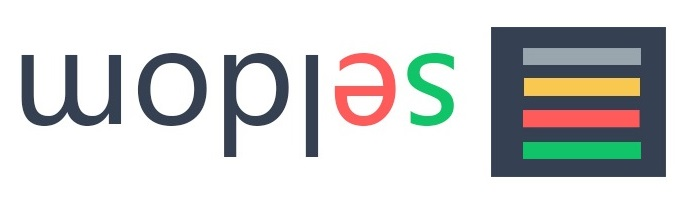
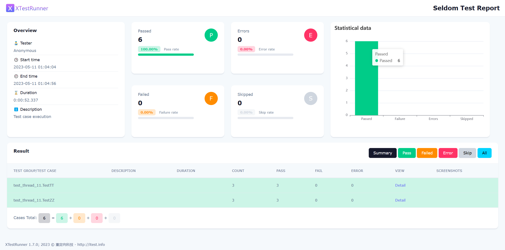

[](https://badge.fury.io/py/seldom) 


WebUI/HTTP automation testing framework based on unittest.

> 基于unittest 的 Web UI/HTTP自动化测试框架。

## 特点

* 提供更加简单API编写自动化测试
* 提供脚手架，快速生成自动化测试项目
* 全局启动和关闭浏览器，减少浏览器的启动次数
* 提供支持多种数据文件参数化
* 支持用例失败/错误重跑
* 支持生成HTML/XML测试报告
* 支持HTTP接口测试 (v 2.0)


### 安装

```shell
> pip install seldom
```

If you want to keep up with the latest version, you can install with github repository url:

```shell
> pip install -U git+https://github.com/SeldomQA/seldom.git@master
```

### Quick Start

1、查看帮助：

```shell
> seldom -h
usage: seldom [-h] [-v] [-project PROJECT] [-h2c H2C] [-r R] [-m M]
              [-install INSTALL]

WebUI/HTTP automation testing framework based on unittest.

optional arguments:
  -h, --help        show this help message and exit
  -v, --version     show version
  -project PROJECT  Create an Seldom automation test project.
  -h2c H2C          HAR file converts an interface test case.
  -r R              run test case
  -m M              run tests modules, classes or even individual test methods
                    from the command line
  -install INSTALL  Install the browser driver, For example, 'chrome', 'firefox',
                    'ie', 'edge', 'opera'.
```

2、创建项目：

```shell
> seldom -project mypro
```

目录结构如下：

```shell
mypro/
├── test_dir/
│   ├── test_sample.py
├── test_data/
│   ├── data.json
├── reports/
└── run.py
```

* `test_dir/` 测试用例目录。
* `test_data/` 测试数据文件目录。
* `reports/` 测试报告目录。
* `run.py` 运行测试用例主文件。

3、运行项目：

> ⚠️ seldom不支持在`pyCharm`中右键执行，请使用cmd/终端。

```shell
> python3 run.py


              __    __
   ________  / /___/ /___  ____ ____
  / ___/ _ \/ / __  / __ \/ __ ` ___/
 (__  )  __/ / /_/ / /_/ / / / / / /
/____/\___/_/\__,_/\____/_/ /_/ /_/  v2.3.0
-----------------------------------------
                             @itest.info

2021-10-12 00:47:33 [INFO] 📖 https://www.baidu.com
2021-10-12 00:47:37 [INFO] ✅ Find 1 element: id=kw , input 'seldom'.
2021-10-12 00:47:38 [INFO] ✅ Find 1 element: css selector=#su , click.
2021-10-12 00:47:40 [INFO] 👀 assertIn title: seldom_百度搜索.
2021-10-12 00:47:40 [INFO] 📖 https://www.baidu.com
2021-10-12 00:47:41 [INFO] ✅ Find 1 element: id=kw , input 'poium'.
2021-10-12 00:47:42 [INFO] ✅ Find 1 element: css selector=#su , click.
2021-10-12 00:47:43 [INFO] 👀 assertIn title: poium_百度搜索.
2021-10-12 00:47:43 [INFO] 📖 https://www.baidu.com
2021-10-12 00:47:44 [INFO] ✅ Find 1 element: id=kw , input 'HTMLTestRunner'.
2021-10-12 00:47:45 [INFO] ✅ Find 1 element: css selector=#su , click.
2021-10-12 00:47:46 [INFO] 👀 assertIn title: HTMLTestRunner_百度搜索.
2021-10-12 00:47:46 [INFO] 📖 http://www.itest.info
2021-10-12 00:47:53 [INFO] 👀 assertIn url: http://www.itest.info/.
2021-10-12 00:47:53 [PRINT] generated html file: file:///D:\mypro\reports\2021_10_12_00_47_32_result.html
2021-10-12 00:47:53 [PRINT] generated log file: file:///D:\mypro\reports\2021_10_12_00_47_32_log.log
.1.2.3.4
```

4、查看报告

你可以到 `mypro\reports\` 目录查看测试报告。



## Demo

### simple demo

[demo](/demo) 提供了丰富实例，帮你快速了解seldom的用法。

简单的实例 `demo/test_dir/test_first_demo.py` 

```python
import seldom


class BaiduTest(seldom.TestCase):

    def test_case(self):
        """a simple test case """
        self.open("https://www.baidu.com")
        self.type(id_="kw", text="seldom")
        self.click(css="#su")
        self.assertTitle("seldom_百度搜索")


if __name__ == '__main__':
    seldom.main()

```

__说明：__

* 创建测试类必须继承 `seldom.TestCase`。
* 测试用例文件命名必须以 `test` 开头。
* seldom的封装了`assertTitle`、`assertUrl` 和 `assertText`等断言方法。

### HTTP 测试

seldom 2.0 支持HTTP测试

```python
import seldom


class TestRequest(seldom.TestCase):

    def test_put_method(self):
        self.put('/put', data={'key': 'value'})
        self.assertStatusCode(200)

    def test_post_method(self):
        self.post('/post', data={'key':'value'})
        self.assertStatusCode(200)

    def test_get_method(self):
        payload = {'key1': 'value1', 'key2': 'value2'}
        self.get("/get", params=payload)
        self.assertStatusCode(200)

    def test_delete_method(self):
        self.delete('/delete')
        self.assertStatusCode(200)


if __name__ == '__main__':
    seldom.main(base_url="http://httpbin.org")
```

### Run the test

```python
import seldom

seldom.main()  # 默认运行当前测试文件
seldom.main(path="./")  # 当前目录下的所有测试文件
seldom.main(path="./test_dir/")  # 指定目录下的所有测试文件
seldom.main(path="./test_dir/test_sample.py")  # 指定目录下的测试文件
```


## Document

[中文文档](/docs)

[English document(readthedocs)](https://seldomqa.readthedocs.io/en/latest/index.html)

## 项目实例

基于seldom的web UI自动化项目：

https://github.com/BarryYBL/UIAutoDemo

基于seldom的接口自动化项目:

https://github.com/defnngj/pyrequest2

## 感谢

感谢从以下项目中得到思路和帮助。

* [HTMLTestRunner_cn](https://github.com/GoverSky/HTMLTestRunner_cn)

* [parameterized](https://github.com/wolever/parameterized)

* [pyderman](https://github.com/shadowmoose/pyderman)

* [utx](https://github.com/jianbing/utx)

## 交流

QQ群：948994709
