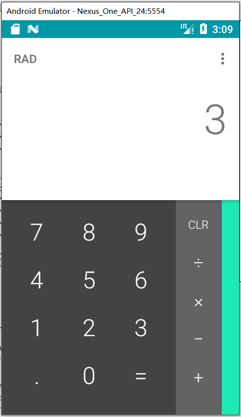

## 支持 appium

因为selenium 和 appium 的近亲关系。seldom 支持appium 并非难事，经过少量代码的改造我们就可以拿seldom来运行App了,而且可以轻松的继承Web自动化测试的所有功能。




```python
import seldom
from seldom import data


class CalculatorTest(seldom.AppCase):

    @data([
        ("case1", "1", "2", "3"),
        ("case2", "3", "4", "7"),
        ("case3", "5", "5", "10"),
    ])
    def test_login(self, _, a, b, result):
        """a simple test case """
        self.click(id_="com.android.calculator2:id/digit_" + a)
        self.click(id_="com.android.calculator2:id/op_add")
        self.click(id_="com.android.calculator2:id/digit_" + b)
        self.click(id_="com.android.calculator2:id/eq")
        text = self.get_text(id_="com.android.calculator2:id/result")
        self.assertText(text, result)


if __name__ == '__main__':
    desired_caps = {
        'deviceName': 'Android Emulator',
        'automationName': 'Appium',
        'platformName': 'Android',
        'platformVersion': '7.0',
        'appPackage': 'com.android.calculator2',
        'appActivity': '.Calculator',
        'noReset': True
    }
    seldom.app(desired_capabilities=desired_caps)

```

通过例子可以看出几乎和web一致。但还是有两点不同。

1.创建测试类继承`seldom.AppCase` 类。

2.运行App通过`seldom.app()` 入口方法。


