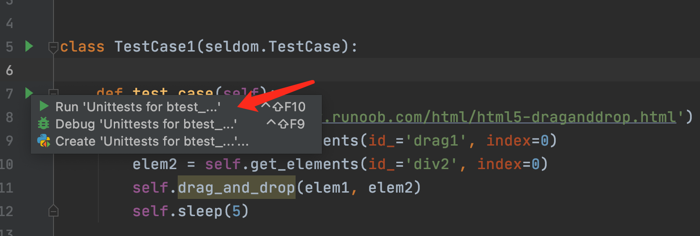

Other
-------

Runs On More Browsers
~~~~~~~~~~~~~~~~~~~~~~~

`seldom` supports running automated tests on different browsers

.. code:: python

    import seldom

    # ...

    if __name__ == '__main__':
        seldom.main(browser="chrome") # chrome,The default
        seldom.main(browser="firefox") # firefox browser
        seldom.main(browser="edge") # edge browser
        seldom.main(browser="safari") # safari browser

Mobile Web Mode
~~~~~~~~~~~~~~~

`seldom` also supports the Mobile Web model.

.. code:: python

    import seldom

    # ...

    if __name__ == '__main__':
        seldom.main(browser="iPhone 6") # iPhone 6

Type of device supported:

.. code:: python

    PHONE_LIST = [
        'iPhone 5', 'iPhone 6', 'iPhone 7', 'iPhone 8', 'iPhone 8 Plus',
        'iPhone X', 'Pixel 2', 'Pixel XL', "Galaxy S5"
    ]
    PAD_LIST = ['iPad', 'iPad Pro']

Headless Mode
~~~~~~~~~~~~~~~~

Firefox and Chrome support 'headless' mode, Enable headless mode for browsing.

.. code:: python

    import seldom
    from seldom import ChromeConfig

    #...

    if __name__ == '__main__':
        ChromeConfig.headless = True
        seldom.main(browser="chrome")

The Firefox browser is configured similarly.

Browser configuration
~~~~~~~~~~~~~~~~~~~~~~~

In order to meet the personalized requirements, such as disabling the browser plug-in, setting the browser proxy, etc.So, open up these capabilities with the arguments of the ChromeConfig class.

.. code:: python

    import seldom
    from seldom import ChromeConfig
    from selenium.webdriver import ChromeOptions

    # ...
    if __name__ == '__main__':
        chrome_options = ChromeOptions()
        chrome_options.add_argument('--ignore-certificate-errors')
        ChromeConfig.options = chrome_options
        seldom.main(browser="chrome")

Selenium Grid
~~~~~~~~~~~~~~~

1. Install the Java environment
2. More configuration, \ `Selenium Server <https://www.selenium.dev/downloads/>`__\ .

.. code:: shell

    > java -jar selenium-server-standalone-3.141.59.jar

    12:30:37.138 INFO [GridLauncherV3.parse] - Selenium server version: 3.141.59, revision: e82be7d358
    12:30:37.204 INFO [GridLauncherV3.lambda$buildLaunchers$3] - Launching a standalone Selenium Server on port 4444
    2020-10-10 12:30:37.245:INFO::main: Logging initialized @301ms to org.seleniumhq.jetty9.util.log.StdErrLog
    12:30:37.417 INFO [WebDriverServlet.<init>] - Initialising WebDriverServlet
    12:30:37.497 INFO [SeleniumServer.boot] - Selenium Server is up and running on port 4444

.. code:: python

    import seldom
    from seldom import ChromeConfig

    # ...
    if __name__ == '__main__':
        ChromeConfig.command_executor = "http://127.0.0.1:4444/wd/hub"
        seldom.main(browser="chrome")

-  More configuration, \ `Selenium Grid
   doc <https://www.selenium.dev/documentation/en/grid/>`__\ .

Run the test in PyCharm
~~~~~~~~~~~~~~~~~~~~~~~~~

1. Configure the test case to run through unittest.

.. figure:: ../image/pycharm.png
   :alt: 

2. Select the test class or use case execution in the file.

Warning: Running the browser that the use case opens requires manual closing, and `seldom` does not do the use case closing action.
