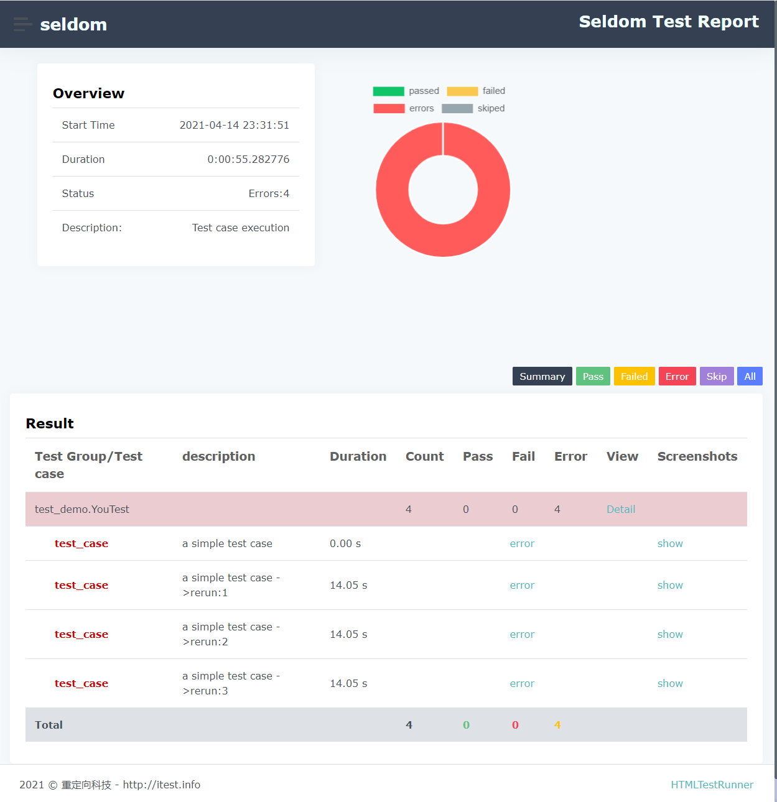

Quick Start
-------------

Download Browser Driver
~~~~~~~~~~~~~~~~~~~~~~~~~

As with `Selenium`, before you can run automated tests using `seldom`, you need to configure the browser driver, This step is very important.

**Automatically download**

`Seldom` provides automatic download driven by `chrome/firefox/ie/edge` browser.

.. code:: shell

    > seldom -install chrome
    > seldom -install firefox
    > seldom -install ie
    > seldom -install edge

- By default, download to the current `C://Users/username/.wdm/drivers/` directory.

- Chrome: `ChromeDriver` Mirror image of Taobao used.

- Safari: `safaridriver` (macOS,default path:`/usr/bin/safaridriver`)

``main()`` Method
~~~~~~~~~~~~~~~~~~~

`main()` method is `seldom` run test entry method, It provides some of the most basic and important configurations.

.. code:: python

    import seldom

    # ...

    if __name__ == '__main__':

        seldom.main(path="./",
                    browser="chrome",
                    base_url=None,
                    report=None,
                    title="project name",
                    tester="Anonymous",
                    description="Environment description",
                    debug=False,
                    rerun=0,
                    language="en",
                    timeout=None,
                    whitelist=[],
                    blacklist=[]
        )

**Parameter specification**

-  path : Specifies the test directory or file.
-  browser : Run browser name(for example: "chrome", "firefox").
-  base\_url : A parameter to test the HTTP interface testing, setting the global URL.
-  report : The name of the custom test report, The default format is `YYYY_mm_dd_HH_MM_SS_result.html`.
-  title : Test report title.
-  title : Specifies the tester, default 'Anonymous'.
-  description : Test report description.
-  debug : Debug mode,  set to True does not generate test HTML tests, default is `False`.
-  rerun : Sets the number of failed reruns, Default is `0`.
-  save\_last\_run : Set to save only the last result, default to `False`.
-  language : Set the HTML report in English and Chinese, default 'en', Chinese `zh-CN`.
-  timeout : Sets the timeout, Default `10` seconds.
-  whitelist :  The use case `label` sets the whitelist.
-  blacklist :  Use case `label` Sets the blacklist.

Run Test
~~~~~~~~~~

**Run under a terminal (recommended)**

Create the file `run.py`, And import `main()` method.

.. code:: py

    import seldom

    seldom.main()

`main()` Method Run the use case in the current file by default.

.. code:: shell

    > python run.py      # Run with the Python command
    > seldom -r run.py   # Run with the Seldom command

**Set the running directory, file**

You can specify the directory or file to run with the `path` parameter.

.. code:: py
    import seldom

    seldom.main(path="./")  
    seldom.main(path="./test_dir/")
    seldom.main(path="./test_dir/test_sample.py")
    seldom.main(path="D:/seldom_sample/test_dir/test_sample.py")

**Run a class or method**

The `seldom -m` command can provide a more granular run.

.. code:: shell

    > seldom -m test_sample     #  test_sample.py file
    > seldom -m test_sample.SampleTest      #  SampleTest Class
    > seldom -m test_sample.SampleTest.test_case    # test_case method

Failed Rerun
~~~~~~~~~~~~~~~~

`seldom` support failed reruns, as well as screenshots.

.. code:: python

    import seldom

    class YouTest(seldom.TestCase):

        def test_case(self):
            """a simple test case """
            self.open("https://www.baidu.com")
            self.type(id_="kw", text="seldom")
            self.click(css="#su_error")
            #...

    if __name__ == '__main__':
        seldom.main(rerun=3)

**Parameters**

-  rerun : Sets the number of failed reruns, Default is `0`.
-  save\_last\_run : Sets to save only the last result, default to `False`.

**Run logs**

.. code:: shell

    > python test_sample.py

**The test report**

To view the screenshots, click the `show` button in the report.

Test Report
~~~~~~~~~~~~~

`seldom` automatically generates HTML test reports by default.

-  Befor running the test case

.. code:: shell

    mypro/
    |--- test_sample.py

-  After running the test case

.. code:: shell

    mypro/
    |-- reports/
    |   |-- 2020_01_01_11_20_33_result.html
    |-- test_sample.py

Open the `2020_01_01_11_20_33_result.html` test report through a browser, View the test results.

**Debug mode**

if you don't want to generate and HTML report every time you run, You can opent the `debug` mode.

.. code:: py

    import seldom

    seldom.main(debug=True)

**Define Test Reports**

.. code:: py

    import seldom

    seldom.main(report="report.html",
                title="xxxx",
                tester="username",
                description="run evn:windows 10/ chrome")

-  report: Configure the report name and path.
-  title: Customize the title of the report.
-  tester: Customize the current tester.
-  description: Add report information.

**XML Test Reoprt**

If you want to generate a report in XML format, just change the suffix name `.xml` of the report.

.. code:: py

    import seldom

    seldom.main(report="report.xml")

